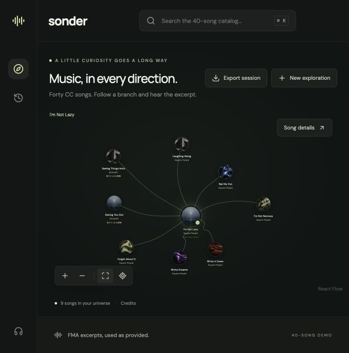

# Sonder — 音楽を、枝をたどるように探す

気になる曲を選び、関連する曲を試聴しながら、自分の探索の軌跡を地図として残す音楽探索アプリです。
**個人プロジェクト：企画・設計・開発。** 「探索した」と「好きだった」を分けて記録し、後から評価できる形にすることを重視しています。

**[デモを試す](https://huggingface.co/spaces/t3-sketch/sonder)** · [直接開く](https://t3-sketch-sonder.static.hf.space/index.html) · [起動方法](#run) · [設計](#architecture-and-replacement-points) · [関連研究](https://github.com/t3-sketch/serendipity-ga-multiobjective)



*Song-level music exploration with Next.js, TypeScript, React Flow, d3-force, and Zustand.*

## できることと設計上の判断

| できること | 設計で重視したこと |
| --- | --- |
| 40曲のCreative Commons音源から選択・枝展開・試聴 | まず固定カタログで一連の探索を体験できる範囲を完成させる |
| 過去の枝を残し、曲を移動・保存する | 画面上の配置と推薦スコアを分離し、探索の軌跡を保持する |
| Like / Saveを明示的に記録する | 曲をクリックしただけで好みと推定しない |
| セッションを保存・書き出す | データの版・由来を含む固定ケースとして、別の研究コードから検査できるようにする |

## 確認できていること

2026-09-14の[公開検証記録](.codex/IMPLEMENTATION_STATE.md)では、試聴・枝展開・保存後の復元と、ダウンロードしたセッションのResearch readerによる検査を確認しています。自動検査・型検査・静的ビルドも通過しています。

現在の推薦は**ジャンルの共通度を使うbaseline**です。推薦品質や「価値ある偶然の発見」が改善したかは未計測で、SASRec・NSGA-IIはこのデモには組み込んでいません。[音源の出典・ライセンス](CREDITS.md)も公開しています。

## Run

```sh
npm ci
npm run dev
```

Open http://localhost:3000. Node.js 22 or later recommended. The npm lockfile pins dependencies. No credentials are needed.

```sh
npm run typecheck
npm test
npm run build
```

The build produces a static `out/` directory. `npm start` serves it on port 3000 using Python’s static server (stop the dev server first).

## Explore

- Search the fixed 40-song Creative Commons catalog (`⌘/Ctrl K`), or choose one of three starting songs.
- A seed opens eight recommendations. Select one to grow seven more, with older branches preserved.
- Drag songs to arrange your map; scroll to pan, pinch to zoom, or use zoom/fit/recenter controls.
- Use Enter on a focused graph node to explore; select a node and use arrow keys to move it.
- The inspector provides explicit Like/Save actions and the audited FMA excerpt for every song. Track and metadata attribution is in [CREDITS.md](CREDITS.md).
- History returns to prior branches. Saved songs survive new explorations. A new exploration replaces the current map.
- The session and positions restore from localStorage in the same browser/origin. Private-mode restrictions or full storage are reported in the UI.

## Architecture and replacement points

| Area | Location | Responsibility |
| --- | --- | --- |
| Domain | `src/domain/types.ts` | Track, graph, session, event, recommendation and placement contracts |
| Composition | `src/services/dependencies.ts` | Inject recommendation and placement implementations |
| Recommendations | `src/services/genreJaccard.ts` | Direct-genre Jaccard baseline; legacy mock retained for schema 0.1 tests |
| Layout | `src/graph/placement.ts` | Deterministic forward fan and collision avoidance |
| Floating motion | `src/graph/floatingGraph.ts` | Gentle anchored D3 drift, collision, hover/drag pinning; render offsets never overwrite saved positions |
| Session | `src/store/exploration.ts`, `src/graph/session.ts` | Branches, active ancestry, async request handling, persistence |
| Graph | `src/components/MusicGraph.tsx`, `SongNode.tsx` | React Flow rendering and gestures |
| Providers | `src/services/musicProviders.ts` | Connection, profile, playlists and library boundary |
| Playback | `src/store/player.ts`, `src/components/MiniPlayer.tsx` | Independent HTML audio state and transport |

Implement `RecommendationProvider.getRecommendations(context)` and replace `dependencies.recommendation`. Neither graph components nor layout need to change. Optional recommendation scores remain metadata and never determine geometric distance.

Implement a `MusicServiceProvider` adapter per service and replace the corresponding `musicProviders` entry. Spotify OAuth/PKCE and Apple MusicKit authorization must retain their different mechanics. Normalize returned tracks, keep service IDs in `externalIds`, and keep any signing secrets server-side. Server routes require changing the static-export configuration or using an external backend.

## Deliberate limits

- A fixed 40-track FMA catalog: direct-genre Jaccard ranking is a transparent baseline, not a claim about preference or recommendation quality.
- FMA excerpts and metadata retain their individual Creative Commons attribution in [CREDITS.md](CREDITS.md); the shared artwork is decorative.
- One locally persisted exploration, not a cloud account or multi-session archive.
- Deterministic collision scan; floating motion pauses for reduced motion or hidden tabs. Upgrade to spatial indexing only after measured placement latency warrants it.
- Genre-based ranking only; no learned embeddings, SASRec, NSGA-II, preference inference or automatic playlist writes.
- The Hugging Face link above is the approved public demo target. Existing `.openai/hosting.json` is an unrelated earlier private Site registration.

See implementation state for verified results and unfinished work rather than assuming this README implies validation.

## 開発を再開する方へ

<details>
<summary>引き継ぎ・ローカル環境の補足</summary>

## Continue implementation

Read [implementation state](.codex/IMPLEMENTATION_STATE.md) first. It records completed work, actual verification results, outstanding issues, and next actions. The [original product brief](.codex/PRODUCT_REQUEST.md) preserves the complete scope. Update the state file after meaningful changes and before ending a session.

User priority: **UI smoothness → speed → everything else.**

### Recovery on this Mac

Existing dependency files under Documents stalled during reads on this machine. A freshly installed, byte-identical source copy outside Documents passed typecheck, tests and build. Use the reproducible fallback if regular commands stall:

```sh
python3 scripts/isolated-run.py dev
# Or: typecheck, test, build
# After build, stop the dev server and run:
python3 scripts/isolated-run.py start
```

The script copies current sources and assets to `~/.cache/sonder-runtime/check`, installs the locked dependencies if needed, and records source hashes in `.codex/SOURCE_SNAPSHOT.json`. This repository remains the source of truth. Stop and rerun the command after editing repository files; the copy is not a live filesystem link. No credentials are copied. The cause of the original filesystem stalls is not established.


</details>
